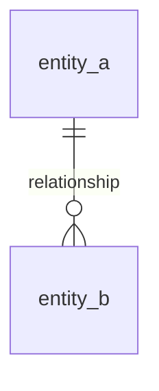
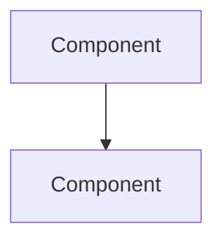
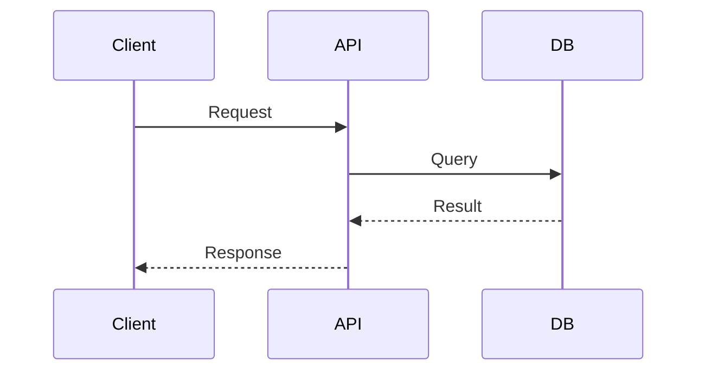
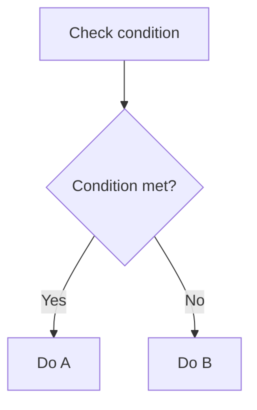
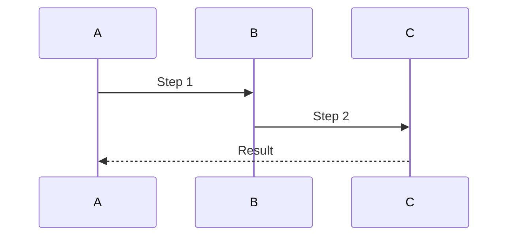

# Technical Spec Document Structure

When creating technical specs (feature specs, system design docs, architecture docs), follow this structure. Not all sections apply to every spec — include what's relevant, skip what's not. Sections marked **(required)** must always appear.

## Document Header (required)

```markdown
# {Feature} Technical Specification

**Version:** 1.0
**Date:** {YYYY-MM-DD}
**Branch:** `{branch-name}`
```

---

## 1. Overview (required)

### 1.1 Problem Statement

What's broken, missing, or suboptimal. Be specific — include metrics, user complaints, or incidents that motivate this work.

### 1.2 Goals

Bullet list of concrete, measurable outcomes. Not vague aspirations.

### 1.3 Prerequisites

| Dependency | Version | Purpose |
|------------|---------|---------|
| PostgreSQL | 13+ | JSONB storage |
| Redis | 6.2+ | Token caching |

### 1.4 Scope

**In scope:** Explicit list of what this spec covers.

**Out of scope:** What it explicitly does NOT cover, with pointers to where those items are tracked.

---

## 2. Database Schema (if data model changes)

### 2.1 New Tables

For each table:

| Column | Type | Nullable | Default | Description |
|--------|------|----------|---------|-------------|
| id | SERIAL PK | No | | |
| name | VARCHAR | No | | Display name |
| data | JSONB | Yes | NULL | Flexible metadata |
| created_at | TIMESTAMPTZ | Yes | now() | |

Include indexes below each table.

### 2.2 Modified Tables

Only the added/changed columns with before/after context.

### 2.3 Entity Relationship Diagram



---

## 3. Architecture (required)

### 3.1 System/Component Overview

High-level diagram showing how components interact.



### 3.2 Role/Permission/State Definitions (if applicable)

Tables mapping roles, states, or categories to their capabilities/behaviors.

| Role | DB Value | Permissions | Use Case |
|------|----------|-------------|----------|

### 3.3 Naming Conventions

| Category | Convention | Examples |
|----------|-----------|----------|
| API routes | kebab-case | `/workspace-members` |
| DB columns | snake_case | `created_at` |

---

## 4. Naming & Taxonomy (if feature introduces new domain concepts)

When a feature introduces permission strings, status enums, role values, event types, or other structured naming that spans multiple files — document them here instead of scattering across Architecture and API sections.

### 4.1 {Category A} Naming: `{pattern}`

```
category.resource.action
manage.users.create
manage.users.read
```

**{N} total keys**

### 4.2 {Category B} Naming: `{pattern}`

```
scope.feature.action
workspace.flows.create
workspace.flows.read
```

**{N} total keys**

### 4.3 Value Conventions

| Category | Convention | Examples |
|----------|-----------|----------|
| System roles | CamelCase | `SUPERADMIN`, `UserAdmin` |
| Workspace roles | PascalCase | `Owner`, `Editor` |
| Legacy values | snake_case (do not use for new) | `wsp_owner` |

**Skip this section** if the feature only uses existing naming patterns.

---

## 5. Migration Strategy (if schema/data changes)

### 4.1 Database Migrations

| Order | Migration | Reversible | Description |
|-------|-----------|------------|-------------|

### 4.2 Rollback Procedure

Step-by-step rollback for each migration in reverse order.

### 4.3 Data Migration

What existing data changes, what doesn't, backward compatibility notes.

---

## 5. Edge Cases (required)

| Scenario | Behavior |
|----------|----------|
| Concurrent requests to same resource | First wins via atomic operation, second gets 409 |
| Entity deleted while referenced | Cascade delete / soft delete / error response |
| Legacy data format encountered | Runtime mapping handles both formats |

---

## 6. Flow Diagrams (required for complex features)

### 6.1 Primary Request Flow



### 6.2 Decision Flows



---

## 8. API Reference (if API changes)

### 8.1 New Endpoints

| Method | Endpoint | Auth | Description |
|--------|----------|------|-------------|
| GET | `/resource` | Auth+ | List resources |
| POST | `/resource` | Admin+ | Create resource |

### 8.2 Modified Endpoints

| Method | Endpoint | Change |
|--------|----------|--------|
| PUT | `/resource/{id}` | Body now accepts `permissions` field |

---

## 9. API Request/Response Examples (if API changes)

Separate section for concrete examples — keeps the API Reference table scannable while giving detailed examples their own space. Include 2-4 examples covering the most complex or non-obvious endpoints.

### 9.1 {Action Name}

**Request:**
```http
POST /resource
Authorization: Bearer <token>
Content-Type: application/json

{
  "name": "Example",
  "permissions": ["read", "write"]
}
```

**Response (201):**
```json
{
  "id": 1,
  "name": "Example",
  "permissions": ["read", "write"],
  "created_at": "2026-01-01T00:00:00Z"
}
```

### 9.2 {Another Action}

*(repeat pattern)*

---

## 10. Domain Deep-Dive (optional, for complex subsystems)

When a feature includes a subsystem that is critical enough to warrant its own detailed section (e.g., token rotation mechanics, payment flow, real-time sync protocol), add a dedicated section here. This prevents bloating Architecture or API sections with implementation details.

### 10.1 {Subsystem Name}

Diagram the subsystem's internal flow:



### 10.2 {Subsystem} Storage/State

| Item | Storage | Expiry | Purpose |
|------|---------|--------|---------|

### 10.3 {Subsystem} Security Features

| Feature | Implementation |
|---------|---------------|

**Skip this section** if the feature has no subsystem complex enough to need its own deep-dive.

---

## 11. Code Changes Summary (required)

### 11.1 New Files

| File | Purpose |
|------|---------|
| `path/to/file.py` | Brief purpose |

### 11.2 Modified Files

| File | Changes |
|------|---------|
| `path/to/existing.py` | What changed and why |

### 11.3 Breaking Changes

| Change | Impact | Mitigation |
|--------|--------|------------|
| Token expiry reduced | All sessions expire | Refresh rotation handles silently |

---

## 12. Frontend Implementation (if UI changes)

### 12.1 Component Changes

Key UI components, permission maps, route guards, state changes.

### 12.2 Implementation Status

- [x] Completed items
- [ ] Planned items

---

## 13. Testing Strategy (required)

### 13.1 Unit Tests

| Area | Test Cases |
|------|------------|
| Permission checker | Verify role resolution, legacy mapping, wildcards |

### 13.2 Integration Tests

| Area | Test Cases |
|------|------------|
| Auth middleware | Customer without permission gets 403; Admin bypasses |

### 13.3 E2E Tests

| Flow | Steps |
|------|-------|
| Full lifecycle | Create -> use -> modify -> delete -> verify cleanup |

---

## 14. Security Assessment (required for auth/data/API features)

### 14.1 Risks Mitigated

| Risk | Before | After | Severity Change |
|------|--------|-------|-----------------|
| Single god-mode role | All admins full access | Granular roles | Critical -> Low |

### 14.2 Remaining Risks

| Risk | Severity | Mitigation Plan |
|------|----------|----------------|
| XSS via localStorage | Medium | CSP headers, input sanitization |

### 14.3 Compliance Gaps (if applicable)

| Standard/Criterion | Status | Gap |
|---|---|---|
| SOC 2 CC6.1 | Partial | Missing MFA |

### 14.4 Recommendations

Numbered list of follow-up security improvements.

---

## 15. File & Function Reference (required)

### 15.1 File Index

#### Backend

```
path/to/models/         # Data models
path/to/api/            # API endpoints
path/to/crud/           # CRUD operations
```

#### Frontend

```
path/to/components/     # UI components
path/to/hooks/          # Custom hooks
path/to/api/            # API client
```

### 15.2 Function Call Chain Map (recommended for M+, required for L/XL)

Document the call chain for each major user action. This serves as a "memory" for AI agents and developers — maps exactly where logic lives across layers.

**Layer architecture:**

```
┌─ UI Component/Screen ──────────────────────────────┐
│   Screen → calls hook                              │
└───────────┬────────────────────────────────────────┘
            │
┌───────────▼─ Hook / Context ───────────────────────┐
│   useFeatureX() → orchestrates, calls API/mutation │
└───────────┬────────────────────────────────────────┘
            │
┌───────────▼─ API Client / Query ───────────────────┐
│   featureApi.create() → HTTP call                  │
└───────────┬────────────────────────────────────────┘
            │
┌───────────▼─ Backend Endpoint ─────────────────────┐
│   POST /api/v1/feature → handler → CRUD → DB      │
└────────────────────────────────────────────────────┘
```

**Function reference table** (one per major action):

| Action | UI Layer | Hook/Context | API Client | Backend Endpoint |
|--------|----------|-------------|------------|------------------|
| Create resource | `CreateDialog` | `useCreateResource()` | `resourceApi.create()` | `POST /resources` |
| List resources | `ResourceList` | `useResources()` | `resourceApi.getAll()` | `GET /resources` |
| Update permissions | `PermissionDrawer` | `useUpdatePermissions()` | `memberApi.updatePermissions()` | `PUT /members/{id}/permissions` |

**Key functions** (list non-obvious utility functions used across the feature):

| Function | File | Purpose |
|----------|------|---------|
| `hasWorkspacePermission()` | `core/permission.py` | Check member CRUD access |
| `require_permission()` | `core/permission.py` | Decorator for admin endpoints |

**Skip 15.2** for XS/S tasks or features with trivial call chains (single file, no cross-layer calls).

---

## Section Selection Guide

| Feature Type | Required Sections |
|---|---|
| Backend-only API | 1, 2, 3, 6, 7, 8, 9, 11, 13, 15 |
| Full-stack feature | All sections |
| Schema migration | 1, 2, 5, 6, 11, 13, 15 |
| Frontend-only | 1, 3, 6, 11, 12, 13, 15 |
| Security/auth feature | All sections, especially 10, 14 |
| Complex domain (permissions, billing) | 1, 2, 3, 4, 5, 6, 7, 8, 9, 10, 11, 13, 14, 15 |
| Refactor | 1, 3, 6, 11, 13, 15 |

**Section index:**
1=Overview, 2=DB Schema, 3=Architecture, 4=Naming/Taxonomy, 5=Migration,
6=Edge Cases, 7=Flow Diagrams, 8=API Reference, 9=API Examples,
10=Domain Deep-Dive, 11=Code Changes, 12=Frontend, 13=Testing,
14=Security, 15=File Index
